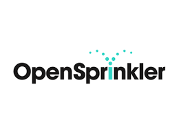

# Balena-OpenSprinkler (Raspberry Pi)

The open Sprinkler is an open source hardware ecosystem for micro-controllers (arduino esp8266) and single board computers (Raspberry Pi (pictured bellow), BeagleBoneBlack)

This repository builds a docker container for the [Balena.io](balena.io) ecosystem which includes all the boards in the BeagleBone and Raspberry Pi product families.

`opensprinkler/Dockerfile` makes use for the [multi-stage builds.](https://docs.docker.com/develop/develop-images/multistage-build/) More information on the use of multi-stage builds with containers can be read [here.](https://www.balena.io/blog/multi-stage-docker-builds-for-tiny-iot-images/)

## Sources

https://github.com/defektive/hydro-pi-frontend
https://github.com/devanl/pyOpenSprinklerRest
https://github.com/JohnStrunk/OpenSprinkler-RPi-docker

## OpenSprinkler Support

[FreshDesk](https://openthings.freshdesk.com/support/solutions/articles/5000713771-user-manual-assemble-the-laser-cut-enclosure-for-ospi)

[GitHub](https://github.com/OpenSprinkler)

[Unified firmware on Raspberry Pi](https://openthings.freshdesk.com/support/solutions/articles/5000631599-installing-and-updating-the-unified-firmware)